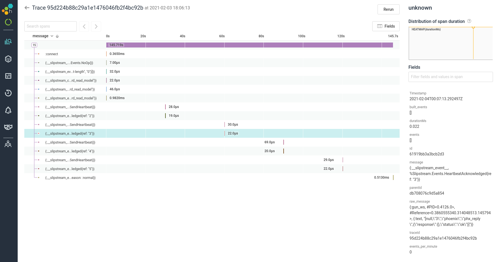

# SlipstreamHoneycomb


An adapter between slipstream telemetry and honeycomb events

## Honeycomb

[Honeycomb](https://www.honeycomb.io/) is an observability tool with a sweet
query interface and distributed tracing support.

At NFIBrokerage, we :heart: honeycomb because it empowers us to debug issues in
fractions of time (and with far more certainty) than log ingestion services,
and lets us understand our system in real-time.

For example, it was almost comically fast to debug this issue:
[NFIBrokerage/slipstream#12](https://github.com/NFIBrokerage/slipstream/issues/12)
because of the telemetry support added in 0.3 and this exporter library.

## Connection Telemetry

SlipstreamHoneycomb currently captures the only telemetry which Slipstream
emits: connection messages.

These connection messages are fairly low-level and are very quick (usually
a matter of microseconds). Below is an example screenshot of a trace in our
Honeycomb:



The long purple bar is the connection, which was open for ~150s in this case.
That came from the `[:slipstream, :connection, :connect, :stop]` event. The
other spans of this connection are `[:slipstream, :connection, :handle,
:stop]`. From top to bottom, we see from the example:

- the initial `handle_continue(:connect, ..`
- the gun connection coming up (`{:gun_up, conn, :http}`)
- the gun upgrade which is decoded into the `%Slipstream.Events.ChannelConnected{}`
  event
- a JoinTopic command from the client
- a `:gun_ws` message that decoded into a TopicJoinSucceeded event
- a big push of data from the remote server (decoded to MessageReceived event)

and then much later (~30s), we see:

- a SendHeartbeat command, followed by
- the HeartbeatAcknowledged

(x4). And finally, the parent process exits with a ParentProcessExited event.

## Installation

```elixir
def deps do
  [
    {:slipstream_honeycomb, "~> 0.1"}
  ]
end
```

Check out the docs here: https://hexdocs.pm/slipstream_honeycomb
